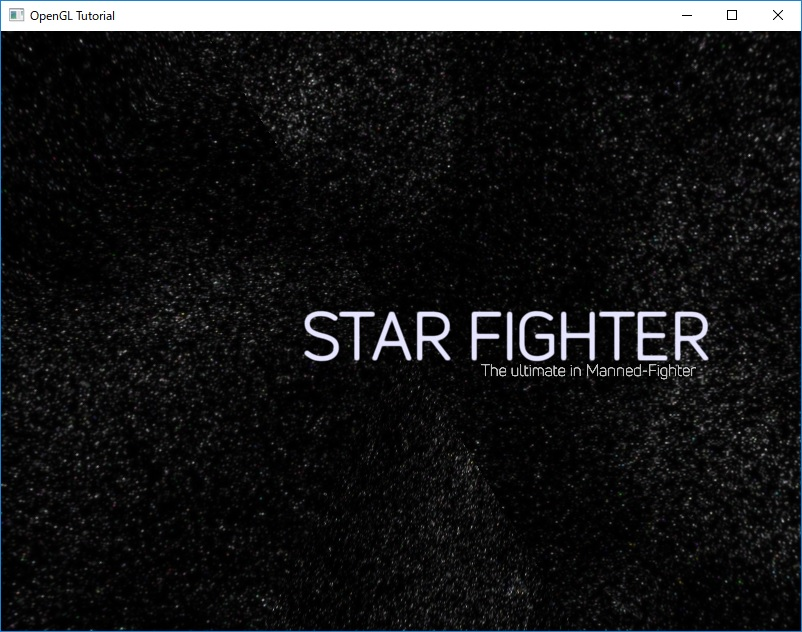
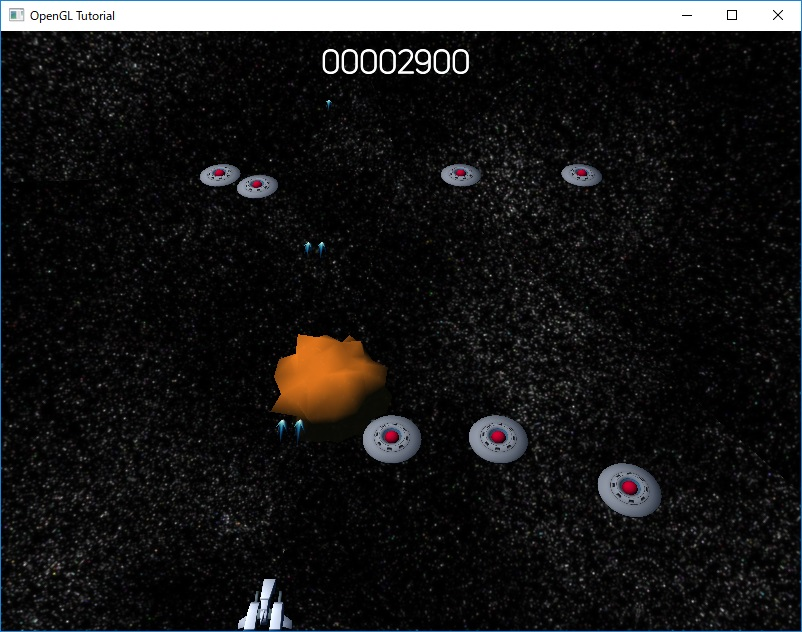

# OpenGLTutorial
OpenGL Tutorial for Microsoft Windows.

Build Tools: Visual Studio 2017 Community
OS: Windows 10 64bit

## Libraries
- OpenGL Mathematics
- GLFW
- GLEW
- FBX SDK 2018.1
- ADX2 LE

## Description
Windows上でOpenGLによるシューティングゲームを作成するための資料です.
日本語の資料はOpenGLTutorial/Docフォルダにあります.
各資料に対応したコードはタグで参照できるようにしてあります.

## Screenshots

